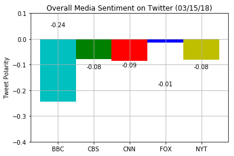
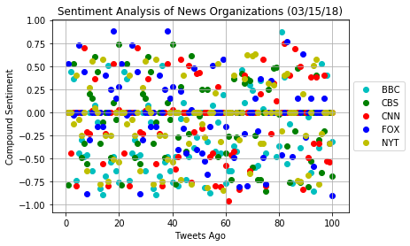

```python

# ## News Mood

# In this assignment, you'll create a Python script to perform a sentiment analysis of the Twitter activity of various news oulets, and to present your findings visually.

# Your final output should provide a visualized summary of the sentiments expressed in Tweets sent out by the following news organizations: __BBC, CBS, CNN, Fox, and New York times__.

# 

# 

# The first plot will be and/or feature the following:

# * Be a scatter plot of sentiments of the last __100__ tweets sent out by each news organization, ranging from -1.0 to 1.0, where a score of 0 expresses a neutral sentiment, -1 the most negative sentiment possible, and +1 the most positive sentiment possible.
# * Each plot point will reflect the _compound_ sentiment of a tweet.
# * Sort each plot point by its relative timestamp.

# The second plot will be a bar plot visualizing the _overall_ sentiments of the last 100 tweets from each organization. For this plot, you will again aggregate the compound sentiments analyzed by VADER.

# The tools of the trade you will need for your task as a data analyst include the following: tweepy, pandas, matplotlib, seaborn, textblob, and VADER.

# Your final Jupyter notebook must:

# * Pull last 100 tweets from each outlet.
# * Perform a sentiment analysis with the compound, positive, neutral, and negative scoring for each tweet. 
# * Pull into a DataFrame the tweet's source acount, its text, its date, and its compound, positive, neutral, and negative sentiment scores.
# * Export the data in the DataFrame into a CSV file.
# * Save PNG images for each plot.

# As final considerations:

# * Use the Matplotlib and Seaborn libraries.
# * Include a written description of three observable trends based on the data. 
# * Include proper labeling of your plots, including plot titles (with date of analysis) and axes labels.
# * Include an exported markdown version of your Notebook called  `README.md` in your GitHub repository.  

```

###  Data Analysis
-  All five news outlets had a negative outlook on their respective twitter feeds.
-  Of all the twitter feeds, Fox was the least likely to post a negative post.
-  Of all the twitter feeds, BBC was by far the most likely to have a negative post on their feed.

##  Twitter News Sentiments


```python
# Import Dependencies
import csv
import time
import tweepy
import numpy as np
import pandas as pd
import seaborn as sns
from datetime import datetime
import matplotlib.pyplot as plt

# Import Vader Sentiment analyzer
from vaderSentiment.vaderSentiment import SentimentIntensityAnalyzer
analyzer = SentimentIntensityAnalyzer()

# Twitter API keys
from config import (consumer_key,
                    consumer_secret,
                    access_token,
                    access_token_secret)

# Tweepy API Authentication
auth = tweepy.OAuthHandler(consumer_key, consumer_secret)
auth.set_access_token(access_token, access_token_secret)
api = tweepy.API(auth, parser=tweepy.parsers.JSONParser())
```


```python
# Target Account (List)
target_users = ["@BBCNews","@CBSNews","@CNN","@FoxNews","@nytimes"]

# Target-specific variables
BBCNews_counter = 1
BBCNews_sentiments = []

CBSNews_counter = 1
CBSNews_sentiments = []

CNN_counter = 1
CNN_sentiments = []

FoxNews_counter = 1
FoxNews_sentiments = []

NYTNews_counter = 1
NYTNews_sentiments = []
    
# Loop through all news feeds
for user in target_users:
    
    # Drop the '@' from target_users
    newsorg = ''.join(user.split('@', 1))
#     print(newsorg)
           
    #Loop through the first five pages (20 tweets per page)
    for page in range(5):
        
        # Get all tweets from feed
        public_tweets = api.user_timeline(user, page=page)
        
        # Loop through all tweets
        for tweet in public_tweets:
            
#             Print Tweets
#             print(f"Tweet %s: %s" % ({newsorg}_counter, tweet["text"]))
            # Run Vader Analyses
            # Add sentiments for each tweet into an array
            results = analyzer.polarity_scores(tweet["text"])
            compound = results["compound"]
            pos = results["pos"]
            neu = results["neu"]
            neg = results["neg"]
            
            if newsorg == "BBCNews":
                tweets_ago = BBCNews_counter
                BBCNews_sentiments.append({"News Organization": "BBC_News",
                                           "Date": tweet["created_at"],
                                           "Text": tweet["text"],
                                           "Compound": compound,
                                           "Positive": pos,
                                           "Negative": neu,
                                           "Neutral": neg,
                                           "Tweets Ago": BBCNews_counter})
                BBCNews_counter += 1
            elif newsorg == "CBSNews":
                
                tweets_ago = CBSNews_counter
                CBSNews_sentiments.append({"News Organization": "CBS_News",
                                           "Date": tweet["created_at"],
                                           "Text": tweet["text"],
                                           "Compound": compound,
                                           "Positive": pos,
                                           "Negative": neu,
                                           "Neutral": neg,
                                           "Tweets Ago": CBSNews_counter})
                CBSNews_counter +=1
            elif newsorg == "CNN":
                
                tweets_ago = CNN_counter
                CNN_sentiments.append({"News Organization": "CNN_News",
                                       "Date": tweet["created_at"],
                                       "Text": tweet["text"],
                                       "Compound": compound,
                                       "Positive": pos,
                                       "Negative": neu,
                                       "Neutral": neg,
                                       "Tweets Ago": CNN_counter})
                CNN_counter +=1
            elif newsorg == "FoxNews":
                
                tweets_ago = FoxNews_counter
                FoxNews_sentiments.append({"News Organization": "FOX_News",
                                           "Date": tweet["created_at"],
                                           "Text": tweet["text"],
                                           "Compound": compound,
                                           "Positive": pos,
                                           "Negative": neu,
                                           "Neutral": neg,
                                           "Tweets Ago": FoxNews_counter})
                FoxNews_counter +=1
            elif newsorg == "nytimes":
                
                tweets_ago = NYTNews_counter
                NYTNews_sentiments.append({"News Organization": "NYT_News",
                                           "Date": tweet["created_at"],
                                           "Text": tweet["text"],
                                           "Compound": compound,
                                           "Positive": pos,
                                           "Negative": neu,
                                           "Neutral": neg,
                                           "Tweets Ago": NYTNews_counter})
                NYTNews_counter +=1
```


```python
# BBCNews_sentiments
# Compile DataFrames
BBC_pd = pd.DataFrame.from_dict(BBCNews_sentiments)
CBS_pd = pd.DataFrame.from_dict(CBSNews_sentiments)
CNN_pd = pd.DataFrame.from_dict(CNN_sentiments)
FNN_pd = pd.DataFrame.from_dict(FoxNews_sentiments)
NYT_pd = pd.DataFrame.from_dict(NYTNews_sentiments)

Sentiments_pd = pd.concat([BBC_pd,
                          CBS_pd,
                          CNN_pd,
                          FNN_pd,
                          NYT_pd], ignore_index = True)
# len(Sentiments_pd)
pd = Sentiments_pd[["News Organization","Date","Tweets Ago","Compound","Text"]]
# BBC_sentiments_pd.head()
# CBS_sentiments_pd.head()
```


```python
# Export to CSV
pd.to_csv("Sentiments.csv", sep = ',', encoding= 'utf-8')
```

###  Sentiment Analysis (Scatter "Compound") for 100 Recent Tweets 


```python
# Make the Scatterplot
# import matplotlib.axes.Axes as ax

BBC = BBC_pd["Compound"]
CBS = CBS_pd["Compound"]
CNN = CNN_pd["Compound"]
FOX = FNN_pd["Compound"]
NYT = NYT_pd["Compound"]

BBC.columns = ["BBC"]
CBS.columns = ["CBS"]
CNN.columns = ["CNN"]
FOX.columns = ["FOX"]
NYT.columns = ["NYT"]

colors = ['c','g','r','b','y']
scatterplots =[
plt.scatter(x = BBC_pd["Tweets Ago"],
            y = BBC,
            c = colors[0]
           ),
plt.scatter(x = CBS_pd["Tweets Ago"],
            y = CBS,
            c = colors[1]
           ),
plt.scatter(x = CNN_pd["Tweets Ago"],
            y = CNN,
            c = colors[2]
           ),
plt.scatter(x = FNN_pd["Tweets Ago"],
            y = FOX,
            c = colors[3]
           ),
plt.scatter(x = NYT_pd["Tweets Ago"],
            y = NYT,
            c = colors[4]
           )]
plt.xlabel("Tweets Ago")
plt.ylabel("Compound Sentiment")
plt.title("Sentiment Analysis of News Organizations (%s)" % (time.strftime("%x")))
plt.legend(scatterplots, ['BBC','CBS','CNN','FOX','NYT'], loc='center left', bbox_to_anchor = (1.0,0.5))
plt.grid()

plt.savefig("ScatterNews.png")

plt.show()
```





###  Tweet Polarity (Means) for News Organizations


```python
# Create a bar chart on the aggregate VADER analysis
BBC_mean = np.mean(BBC)
CBS_mean = np.mean(CBS)
CNN_mean = np.mean(CNN)
FNN_mean = np.mean(FOX)
NYT_mean = np.mean(NYT)

# Place agg mean into tuple
CompoundMeans = (BBC_mean,
                 CBS_mean,
                 CNN_mean,
                 FNN_mean,
                 NYT_mean)

# Plots
fig, ax = plt.subplots()
ind = np.arange(len(CompoundMeans))
width = 1

# Box plots
rects1=ax.bar(ind[0], CompoundMeans[0], width, color='c')
rects2=ax.bar(ind[1], CompoundMeans[1], width, color='g')
rects3=ax.bar(ind[2], CompoundMeans[2], width, color='r')
rects4=ax.bar(ind[3], CompoundMeans[3], width, color='b')
rects5=ax.bar(ind[4], CompoundMeans[4], width, color='y')

# Set plot parameters
ax.set_ylabel('Tweet Polarity')
ax.set_title('Overall Media Sentiment on Twitter (%s)' % (time.strftime("%x")))
ax.set_xticks(ind)
ax.set_xticklabels(('BBC','CBS','CNN','FOX','NYT'))
ax.set_autoscaley_on(False)
ax.set_ylim([-0.4,0.1])
ax.grid(True)

# plot labels (function)
def autolabeler(rects):
    for rect in rects:
        height = rect.get_height()
        ax.text(rect.get_x() + rect.get_width()/2., -1*(height+0.2),
                '%.2f' % (height), ha = 'center', va='bottom',
                color="black")
        
autolabeler(rects1)
autolabeler(rects2)
autolabeler(rects3)
autolabeler(rects4)
autolabeler(rects5)

plt.savefig("BarNews.png")
plt.show()
```


